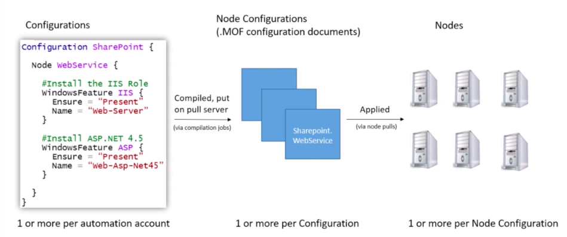
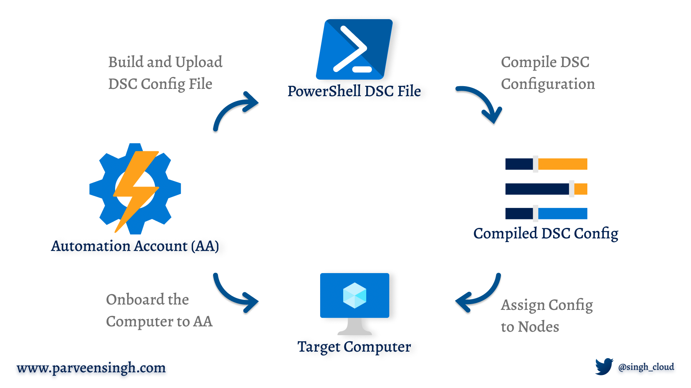
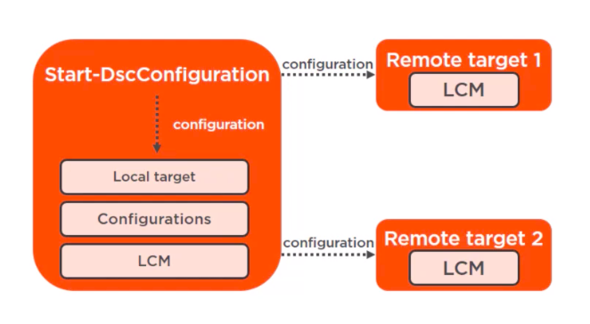
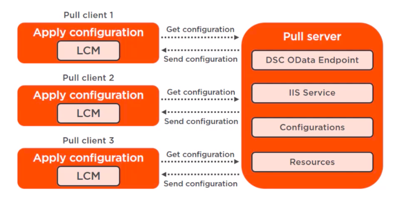

# Table Of Content
  * [Problems](#problems)
  * [What is DSC ?](#what-is-dsc--)
  * [Powershell DSC](#powershell-dsc)
  * [Azure Automation DSC](#azure-automation-dsc)
  * [DSC Strategies](#dsc-strategies)
  * [Local Configuration Manager](#local-configuration-manager)
  * [Settings in LCM](#settings-in-lcm)
  * [Report Status](#report-status)
  * [General DSC Command to Know](#general-dsc-command-to-know)
  * [Reuse-ability (Module)](#reuse-ability--module-)
  * [Reference](#reference)
## Problems 

- How do I ensure all of my machines are matching their intended configuration and remain in the correct state?
- How do I prevent machine configuration from drifting from the desired state, due to changes made by people, process, and programs?
- How do I ensure new machines match the configuration of existing machines in the same role?
- How do I seamlessly set a new desired configuration for all or a subset of my machines?
- How do I limit access to who can change the desired configuration of machines or machine roles?
- How do I orchestrate configuration changes without impacting uptime?
- How do I do all of the above, consistently, across on-premises machines and those in public clouds, and across Windows and Linux?

## What is DSC ?

- **Desired State Configuration (DSC)**: essential element of server, support, and administration Windows-based setup
- **PowerShell DSC**: PowerShell Desired State Configuration (DSC)
- PowerShell help to configure and create MOF server files
- Control the current state of resources that are applied to config to check the machine consistency
- Automatically correct your system's configuration, so it's always in the state of desire

## Powershell DSC



- DSC uses a specially crafted "MOF" file format 
- MOF file contains all the information about the machine's configuration and any metadata associated with the configuration

## Azure Automation DSC



- Advantages of Azure Automation DSC over PowerShell DSC:
    + Easier to configure
    + Integration with existing PowerShell Systems
    + Flexibility
    + The pull server provided by Azure Automation DSC can be used to store all DSC configurations and resources
    + Reporting allows you to keep track of the compliant state

## DSC Strategies

 - **Push and Pull**

    + **Push** (Cons): The current configuration would not be applicable if the target nodes are down
    

    + **Pull**: Target nodes can automatically receive configurations, conform to the desired state, and report on their compliance. The built-in pull server in Azure Automation eliminates the need to set up and maintain your own pull server
    

## Local Configuration Manager

- Manage the state of local server
- Suppose the Pull mechanism is used, LCM periodically surveys the remote servers to verify if they are in the desired state unless the setup is called to render them in the desired state

## Settings in LCM

- **RegistrationUrl**: < Automation Account URL >

- **NodeConfigurationName**: < xSQLInstance.localhost >

- **ConfigurationMode**:
	+ **ApplyOnly**: DSC applies the configuration and does nothing further
	+ **ApplyAndMonitor**: (Default) Apply the DSC configuration and check any change on server then report
	+ **ApplyAndAutoCorrect**: Apply configuration and check if server no longer in desired state then report and bring it back to current DSC configuration

- **RebootNodeIfNeeded** (Boolean): Reboot server if a DSC configuration that requires

- **ActionAfterReboot**:
	+ ContinueConfiguration: Continue apply
	+ StopConfiguration: Stop the current configuration

- **AllowModuleOverwrite** (Boolean): Allow overwrite old configuration on target node

- **RefreshFrequencyMins**:	The time interval to check and get update configuration

- **ConfigurationModeFrequencyMins**: The time interval of the current configuration is checked and applied

- **RegistrationKey**: < Automation Account Key Access >

## Report Status

- **Compliant**: Target node is compliant with the check
- **Failed**: configuration failed the check
- **Not Compliant**: Target node is in ApplyandMonitor mode and the machine is not in the desired state
- **Unresponsive**: If a certificate expires without renewal, the node is unable to communicate with Azure Automation (Before Windows server)

## General DSC Command to Know

- **Get-DSCResource**: shows you the available DSC resources
- **Get-DSCConfiguration**: gets the configuration of a given node along with the details
- **Get-DSCConfiguration**: queries the local configuration status of the machine
- **Get-DSCLocalConfigurationManager**: gets the local configuration, meta-data, and state of the node
- **Update-DSCConfiguration**: pull the state configuration file and apply changes, if any

----------- DEMO -----------

**Lab**: Setup SQL Server

    Azure Portal:
        - Create storage account
        - Upload sql source to file share
        - Create automation account
        - Import module (https://docs.microsoft.com/en-us/azure/automation/shared-resources/modules)
        - Import configuration file (SQLInstance.ps1)
        - Compile configuration file -> SQLInstance.localhost (mof file)
        - Register node to pull server
        - Assign node configuration
        - Monitor

    DSC Configuration file:
              Setup                             Module                          DSC Resource

    Install Essential packages                 Built-in                        WindowsFeature      
    SQL install packages              xPSDesiredStateConfiguration                xArchive
    Install SQL server                       SqlServerDsc                         SqlSetup
    Enable TCP                               SqlServerDsc                        SqlProtocol    
    Allow remote (SQL Development)           SqlServerDsc                     SqlConfiguration
    Allow firewall                           SqlServerDsc                     SqlWindowsFirewall

## Reuse-ability (Module)

- A composite resource

- Manage groups of settings:
    + Create a web server
    + Create a DNS server
    + Configure a SQL cluster
    + Manage firewall settings
    + Manage password settings

- Composite resource folder structure:
```
tree DSC

_____DSC
    |
    InitSql
    |___InitSql.psd1
    |___DSCResources
    |   |___Dot_Net
    |   |   |___Dot_Net.psd1
    |   |   |___Dot_Net.schema.psm1
    |   |
    |   |___File_Source
    |       |___File_Source.psd1
    |       |___File_Source.schema.psm1
    |
    SetupSql
    |___SetupSql.psd1
    |___DSCResources
        |___Setup_Sql
            |___Setup_Sql.psd1
            |___Setup_Sql.schema.psm1
``` 

- Upload composite resources (InitSql,SetupSql) to modules gallery

- (Demo) Rewrite node configuration file (SQLInstance-Remake.ps1)

```diff
...
-    WindowsFeature NetFramework # Resource in module
-    {
-      Name   = 'NET-Framework-45-Core'
-      Ensure = 'Present'
-    }
-
-    xArchive GetSource 
-    {
-      Ensure = "Present"
-      Path = "\\ntglabdevdata.file.core.windows.net\sqlsources\SQL2019.zip"
-      Destination = "C:\"
-      Credential = (Get-AutomationPSCredential 'cred_store')
-    }
-    SqlSetup DB 
-    {
-      DependsOn             = '[xArchive]GetSource'
-      InstanceName          = 'MSSQLSERVER'
-      SourcePath            = 'C:\SQL2019'
-      Features              = 'SQLENGINE'
-      InstallSharedDir      = 'C:\Program Files\Microsoft SQL Server'
-      InstallSharedWOWDir   = 'C:\Program Files (x86)\Microsoft SQL Server'
-      InstanceDir           = 'C:\Program Files\Microsoft SQL Server'
-      SQLSysAdminAccounts   = @('Administrators')
-      InstallSQLDataDir     = 'C:\Program Files\Microsoft SQL Server\MSSQL19.MSSQLSERVER\MSSQL\Data'
-      SQLUserDBDir          = 'C:\Program Files\Microsoft SQL Server\MSSQL19.MSSQLSERVER\MSSQL\Data'
-      SQLUserDBLogDir       = 'C:\Program Files\Microsoft SQL Server\MSSQL19.MSSQLSERVER\MSSQL\Data'
-      SQLTempDBDir          = 'C:\Program Files\Microsoft SQL Server\MSSQL19.MSSQLSERVER\MSSQL\Data'
-      SQLTempDBLogDir       = 'C:\Program Files\Microsoft SQL Server\MSSQL19.MSSQLSERVER\MSSQL\Data'
-      SQLBackupDir          = 'C:\Program Files\Microsoft SQL Server\MSSQL19.MSSQLSERVER\MSSQL\Data'
-      SecurityMode          = 'SQL'
-      SAPwd                 = (Get-AutomationPSCredential 'cred_sql')
-      UpdateEnabled         = $true
-      SQLSvcStartupType     = 'Automatic'
-    }
-
-    SqlProtocol 'ChangeTcpIpOnDefaultInstance'
-    {
-      DependsOn              ='[SqlSetup]DB'
-      InstanceName           = 'MSSQLSERVER'
-      ProtocolName           = 'TcpIp'
-      Enabled                = $true
-      ListenOnAllIpAddresses = $true
-      KeepAlive              = 20000
-    }
-
-    SqlConfiguration 'AllowRemoteAccess'
-    {
-      DependsOn      ='[SqlSetup]DB'
-      InstanceName   = 'MSSQLSERVER'
-      OptionName     = 'remote access'
-      OptionValue    = 1
-      RestartService = $true
-    }
-
-    SqlWindowsFirewall 'AllowFirewall'
-    {
-      DependsOn             = '[SqlSetup]DB'
-      InstanceName          = 'MSSQLSERVER'
-      Features              = 'SQLEngine'
-      SourcePath            = 'C:\SQL2019'
-    }
-
-    SqlDatabase 'CreateDbaDatabase'
-    {
-      DependsOn             = '[SqlSetup]DB'
-      InstanceName          = 'MSSQLSERVER'
-      Name                  = 'DBA'
-    }
+    Init_Sql EssentialPackage 
+    {
+      WindowsFeatures = 'NET-Framework-45-Core'
+      SrcPath         = '\\ntglabdevdata.file.core.windows.net\sqlsources\'
+      SqlVer          = 'SQL2019'
+    }
+
+    Setup_Sql SetupSqlInstance
+    {
+      DependsOn   = '[Init_Sql]EssentialPackages'
+      SourcePath  = 'C:\SQL2019'
+      Features    = 'SQLENGINE'
+    }
...
```

## Reference

- [Using configuration data in DSC](https://docs.microsoft.com/en-us/powershell/scripting/dsc/configurations/configdata?view=powershell-7.1)
- [Trigger compile DSC configuration](https://github.com/robcamer/TerraformModuleApplyingDSC/blob/main/modules/dsc/main.tf)
